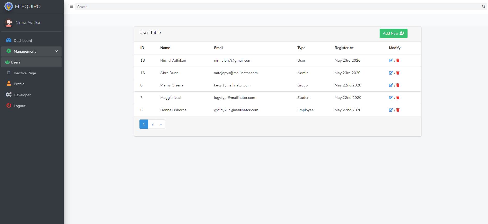

# laravel-vue-starter
Laravel 7 With Vue.js adminpanal with adminlte 3
##  Included 

* Laravel 7
* Vue Router with Laravel
* AdminLTE 3
* Font Awesome 5
* API
* Laravel Passport
* JWT with Laravel Passport and JavaScript Request
* Vue Custom Events
* Vue form (Vform)
* MySql For Database
* Axios and Ajax Request
* ACL 
* User Crud
* Profile Update

## Installation

It's just like any other Laravel project. Basically here is how you use it for yourself. (it's not completed yet) 

* Clone the repo ` https://github.com/nirmalbrj7/laravel7-vue-starter.git `
* `cd ` to project folder. 
* Run ` composer install `
* Save as the `.env.example` to `.env` and set your database information 
* Run ` php artisan key:generate` to generate the app key
* Run ` npm install ` 
* Run ` php artisan migrate ` 
* Run ` php artisan passport:install ` 
* Run ` php artisan serve ` 
* Run ` npm run watch `  in Parallel of ` php artisan serve `  command to build and watch real time vue changes

*  !!! Enjoy

##Demo

